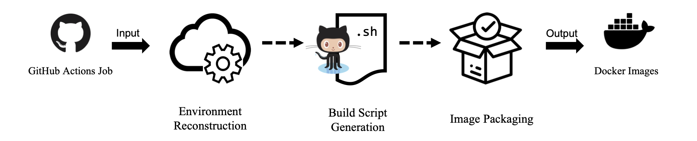

# ActionsRemaker
Short description here


## Setting up ActionsRemaker

### Requirements

* Ubuntu 18.04 or higher
* Python 3.8
* Python3-virtualenv
* [Docker](https://docs.docker.com/engine/install/ubuntu/)

### Installation

1. Clone the repository:
```shell
~$ git clone https://github.com/BugSwarm/actions-remaker
~$ cd actions-remaker
```

2. Create and activate a Python virtual environment:
```shell
~/actions-remaker$ virtualenv -p python3.8 venv
~/actions-remaker$ . venv/bin/activate
```

3. Install dependencies
```shell
(venv) ~/actions-remaker$ pip install -e .
```

### Usage
- Reproduce a single run
    ```shell
    run.sh -r <repo-slug> -j <job-id>
    ```
- Reproduce a failed/passed pair
    ```shell
    run.sh -r <repo-slug> -f <failed-job-id> -p <passed-job-id>
    ```


### Examples

1. Reproduce a [failed job](https://github.com/Grasscutters/Grasscutter/actions/runs/3344953329/jobs/5552953144) and a [passed job](https://github.com/Grasscutters/Grasscutter/actions/runs/3351485580/jobs/5552966102).
    ``` shell
    (venv) ~/actions-remaker$ bash run.sh -r Grasscutters/Grasscutter -f 9179386809 -p 9179402125
    ```
    View reproduced failed job log:
    ```shell
    (venv) ~/actions-remaker$ cat reproducer/output/tasks/task/Grasscutters/Grasscutter/-1-3344953329-3351485580/9179386809-9179402125/9179386809.log
    ```
    View reproduced passed job log:
    ```shell
    (venv) ~/actions-remaker$ cat reproducer/output/tasks/task/Grasscutters/Grasscutter/-1-3344953329-3351485580/9179386809-9179402125/9179402125.log
    ```
    Check newly generated Docker images:
    ```shell
    (venv) ~/actions-remaker$ docker image ls
    REPOSITORY                         TAG                                       IMAGE ID       CREATED              SIZE
    job_id                             9179402125                                c9421d72ee0e   About a minute ago   11.6GB
    job_id                             9179386809                                086391da557b   About a minute ago   11.6GB
    ```
3. Reproduce just the [failed job](https://github.com/Grasscutters/Grasscutter/actions/runs/3344953329/jobs/5552953144)
    ``` shell
    (venv) ~/actions-remaker$ bash run.sh -r Grasscutters/Grasscutter -j 9179386809
    ```
